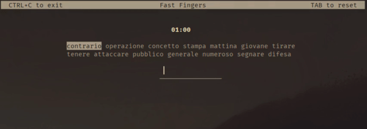

A clone for the Linux terminal of the game [10fastfingers](https://10fastfingers.com/) written in C.

## Compile

Copy the repo and compile the code

	git clone https://github.com/its-fonsy/fastfingers.git
	cd fastfingers
	make

then play!

	./fastfingers

## Language

The supported language are in `lang/` folder. To change language run

	fastfingers -l english

## Commands

- exit with <kbd>CTRL+C</kbd>
- restart or play again with <kbd>TAB</kbd>

# License
MIT License
